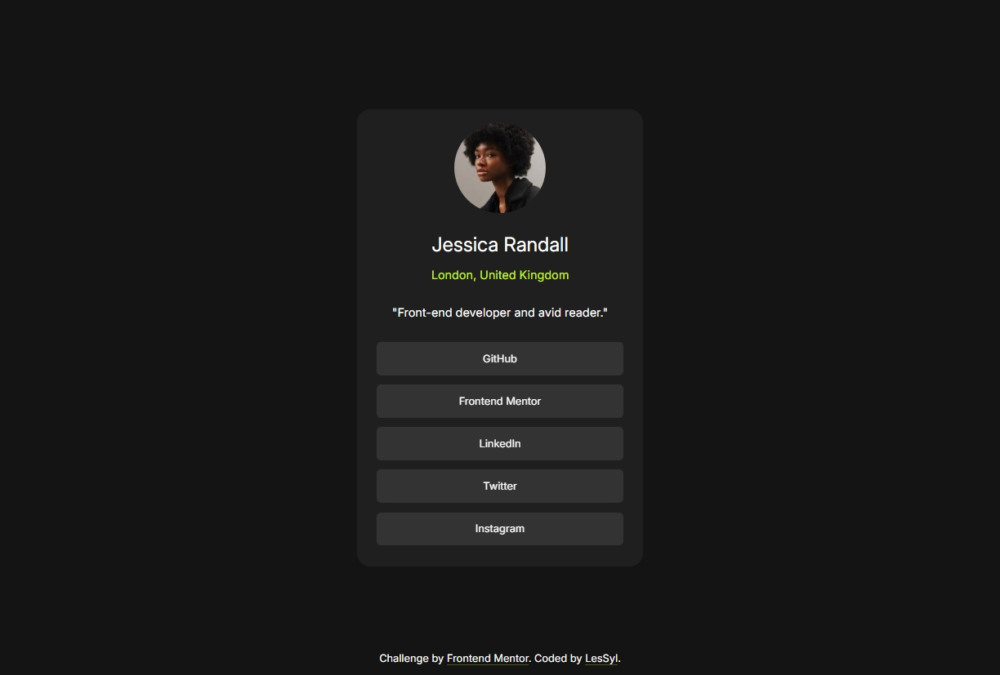
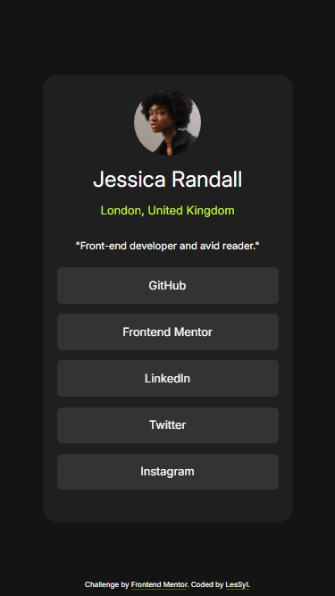

# Frontend Mentor - Social links profile solution

This is a solution to the [Social links profile challenge on Frontend Mentor](https://www.frontendmentor.io/challenges/social-links-profile-UG32l9m6dQ). Frontend Mentor challenges help you improve your coding skills by building realistic projects. 

## Table of contents

- [Overview](#overview)
  - [Screenshot](#screenshot)
  - [Links](#links)
- [My process](#my-process)
  - [Built with](#built-with)
  - [What I learned](#what-i-learned)
- [Author](#author)

## Overview

### Screenshot
Desktop

Mobile

### Links

- Repository URL:[GitHub](https://github.com/LesSyl/Social-links-profile)
- Solution URL: [Frontendmentor](https://www.frontendmentor.io/solutions/social-links-profile-solution-8Cj7hosw_1)
- Live Site URL: [Live](https://lessyl.github.io/Frontend-Mentor---Social-links-profile/)

## My process

### Built with

- Semantic HTML5 markup
- Mobile-first workflow
- Sass
- BEM
- Flexbox
- Kit
- @Keyframes

### What I learned
In this project, I practised writing HTML and SCSS code. To add variety to the project I added some animations using @keyframes.

## Author

- Frontend Mentor - [@LesSyl](https://www.frontendmentor.io/profile/LesSyl)
- gitHub - [@LesSyl](https://github.com/LesSyl)
